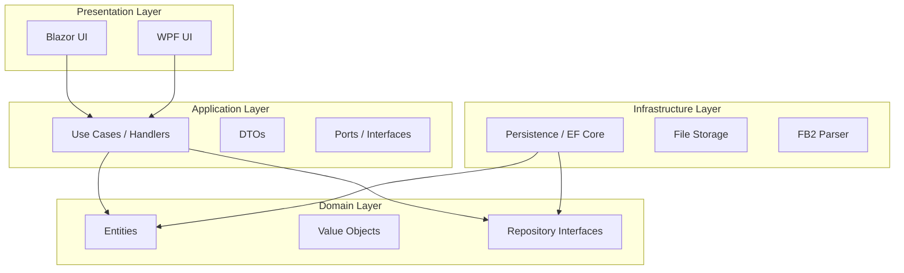

# Архитектура проекта Fb2Library

## 🎯 Цели архитектуры

- Следование принципам **Clean Architecture**
- **Separation of Concerns** (разделение ответственности)
- **Testability** (возможность тестирования каждого слоя)
- **Framework Independence** (независимость от внешних фреймворков)
- **Database Independence** (возможность смены БД)

## 💡 Общая структура чистой архитектуры
---

## 🧱 Структура слоев

### Domain Layer (Fb2Library.Domain)

**Ответственность:**
- Бизнес-сущности (`Book`, `Bookmark`, `Comment`)
- Value Objects (`Rating`, `FilePath`)
- Интерфейсы репозиториев (`IBookRepository`)
- Доменные исключения

**Зависимости:** Нет зависимостей от других слоев.

**Правила:**
- Не содержать внешних ссылок (кроме .NET Standard)
- Все свойства — приватные сеттеры (инкапсуляция)
- Бизнес-логика внутри сущностей

---

### Application Layer (Fb2Library.Application)

**Ответственность:**
- Use Cases (Commands/Queries)
- DTO (Data Transfer Objects)
- Маппинг Entity → DTO
- Интерфейсы портов (`IFb2ParserService`, `IFileStorageService`)

**Зависимости:** Только Domain Layer.

**Правила:**
- Не содержать логики работы с БД
- Не содержать логики работы с файлами
- Использовать интерфейсы для внешних зависимостей

---

### Persistence Layer (Fb2Library.Persistence)

**Ответственность:**
- `ApplicationDbContext`
- Реализация репозиториев (`BookRepository`)
- Миграции Entity Framework Core

**Зависимости:** Domain + Application (через интерфейсы).

**Правила:**
- Реализовывать интерфейсы из Domain
- Инкапсулировать логику работы с БД

---

### Infrastructure Layer (Fb2Library.Infrastructure)

**Ответственность:**
- `Fb2ParserService` (парсинг FB2 файлов)
- `FileStorageService` (работа с файловой системой)
- Другие внешние сервисы

**Зависимости:** Domain + Application (через интерфейсы).

**Правила:**
- Реализовывать интерфейсы из Application
- Изолировать внешние зависимости

---

### Presentation Layer (Fb2Library.Blazor / Fb2Library.Wpf)

**Ответственность:**
- UI-компоненты (Pages, Views)
- ViewModels (для WPF)
- Взаимодействие с пользователем

**Зависимости:** Application + Persistence/Infrastructure (через DI).

**Правила:**
- Не содержать бизнес-логики
- Только взаимодействие с пользователем
- Использовать Dependency Injection для получения сервисов

---

## 🔄 Потоки данных

### Добавление книги

1. Пользователь загружает FB2 файл → **Blazor**
2. Blazor вызывает `CreateBookCommand` → **Application**
3. `CreateBookHandler` использует `IFileStorageService` → **Infrastructure** (сохраняет файл)
4. `CreateBookHandler` использует `IFb2ParserService` → **Infrastructure** (парсит метаданные)
5. `CreateBookHandler` создает `Book` → **Domain**
6. `CreateBookHandler` использует `IBookRepository` → **Persistence** (сохраняет в БД)
7. Blazor получает `BookDto` и отображает страницу

### Поиск книг

1. Пользователь вводит запрос → **Blazor**
2. Blazor вызывает `SearchBooksQuery` → **Application**
3. `SearchBooksHandler` использует `IBookRepository` → **Persistence**
4. `IBookRepository` выполняет поиск в БД
5. Blazor получает список `BookDto` и отображает

---

## 🗂️ Правила именования

| Слой | Сущность | Пример |
| :--- | :--- | :--- |
| Domain | Сущности | `Book`, `Bookmark` |
| Domain | Value Objects | `Rating`, `FilePath` |
| Domain | Интерфейсы | `IBookRepository` |
| Application | Команды | `CreateBookCommand` |
| Application | Запросы | `SearchBooksQuery` |
| Application | Хендлеры | `CreateBookHandler` |
| Application | DTO | `BookDto` |
| Application | Интерфейсы | `IFb2ParserService` |
| Persistence | Контекст | `ApplicationDbContext` |
| Persistence | Репозитории | `BookRepository` |
| Infrastructure | Сервисы | `Fb2ParserService` |

---

## 🧪 Тестирование

### Domain.Tests
- Тесты бизнес-логики в сущностях
- Без внешних зависимостей
- Пример: `BookTests.cs`

### Application.Tests
- Тесты Use Cases с моками
- Использовать библиотеку `Moq` или `NSubstitute`
- Пример: `CreateBookHandlerTests.cs`

### Integration.Tests
- Тесты с реальной БД (SQLite In-Memory)
- Тесты файловой системы (временные папки)
- Пример: `BookRepositoryTests.cs`

---

## 🔗 Связанные документы

- [План разработки](./DEV_PLAN.md)
- [Схема базы данных](./database-schema.md)
- [UI макеты](./ui-mockups.md)
- [Правила кодирования](./guidelines.md)

---

## 📅 История изменений

| Дата | Версия | Изменения |
| :--- | :--- | :--- |
| 2025-01-XX | v1.0 | Создана архитектурная документация |