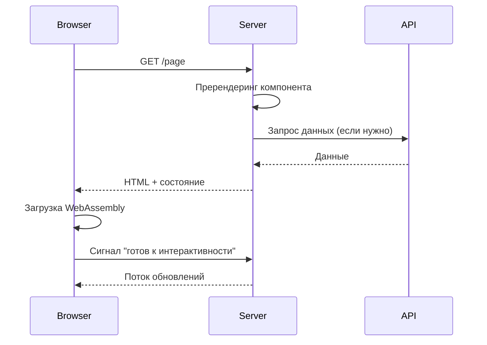

## **Как работает Blazor WebAssembly с серверным пререндерингом**

Давайте разберем всю архитектуру пошагово:

### **1. Общая архитектура вашего приложения**

```
📦 Ваше приложение
├── 🖥️ Серверная часть (Blazor.Server)
│   ├── API Контроллеры (REST API)
│   ├── Blazor Компоненты
│   └── Пререндеринг WebAssembly
│
├── 🌐 Клиентская часть (Blazor.Client)
│   ├── WebAssembly компоненты
│   └── Интерактивный UI в браузере
│
└── 📚 Библиотеки классов
    ├── Domain (Бизнес-логика)
    ├── Application (Сервисы)
    └── Infrastructure (БД, внешние сервисы)
```

### **2. Жизненный цикл запроса**



#### **Детально по шагам:**

**Шаг 1: Первый запрос**
```csharp
// Браузер запрашивает страницу
GET https://localhost:7236/books

// Сервер запускает пререндеринг
app.MapRazorComponents<App>()
    .AddInteractiveWebAssemblyRenderMode() // ← Это включает пререндеринг
```

**Шаг 2: Пререндеринг на сервере**
```csharp
// Компонент выполняется на сервере ПЕРЕД отправкой в браузер
@page "/books"

@if (books == null)
{
    <p>Загрузка...</p>
}
else
{
    @foreach (var book in books)
    {
        <div>@book.Title</div>
    }
}

@code {
    private List<Book>? books;

    protected override async Task OnInitializedAsync()
    {
        // Этот код выполняется ДВАЖДЫ:
        // 1. На сервере (пререндеринг)
        // 2. В браузере (WebAssembly)
        books = await Http.GetFromJsonAsync<List<Book>>("api/books");
    }
}
```

**Шаг 3: Сохранение состояния**
```csharp
// AppState сохраняет данные между пререндерингом и WebAssembly
public class AppState
{
    public Dictionary<string, object> Cache { get; set; } = new();

    // Сервер сохраняет состояние
    public void SaveState<T>(string key, T value)
    {
        Cache[key] = value;
        NotifyStateChanged();
    }

    // WebAssembly загружает состояние
    public T? GetState<T>(string key)
    {
        return Cache.TryGetValue(key, out var value) ? (T)value : default;
    }
}
```

### **3. Как работает HttpClient**

```csharp
// РЕГИСТРАЦИЯ
builder.Services.AddHttpClient("ServerApi", client =>
{
    client.BaseAddress = new Uri("https://localhost:7236/");
})
.AddTransientHttpErrorPolicy(policy =>
    policy.WaitAndRetryAsync(3, retryAttempt => 
        TimeSpan.FromSeconds(Math.Pow(2, retryAttempt))));

// ИСПОЛЬЗОВАНИЕ В КОМПОНЕНТАХ
@inject IHttpClientFactory ClientFactory

@code {
    protected override async Task OnInitializedAsync()
    {
        var client = ClientFactory.CreateClient("ServerApi");
        
        try
        {
            // Автоматически применяется retry policy
            var data = await client.GetFromJsonAsync<MyData>("api/data");
        }
        catch (Exception ex)
        {
            // Ошибка после 3 попыток
        }
    }
}
```

#### **Retry Policy в действии:**
```
Запрос 1: ❌ HTTP 503 (Service Unavailable)
  ↓ Ждем 2 секунды
Запрос 2: ❌ HTTP 503
  ↓ Ждем 4 секунды
Запрос 3: ❌ HTTP 503
  ↓ Ждем 8 секунд
Исключение: "Сервис недоступен после 3 попыток"
```

### **4. Как работает Antiforgery**

```csharp
// КОНФИГУРАЦИЯ
builder.Services.AddAntiforgery(options =>
{
    options.Cookie.HttpOnly = true;     // JavaScript не может прочитать cookie
    options.Cookie.SameSite = SameSiteMode.Strict;  // Защита от CSRF
    options.Cookie.SecurePolicy = CookieSecurePolicy.Always;  // Только HTTPS
});

// В HTML генерируется скрытое поле:
<form method="post">
    <input type="hidden" name="__RequestVerificationToken" 
           value="CfDJ8NrAkS..." />
    <!-- Ваши поля -->
</form>

// Сервер проверяет токен при POST запросе:
[HttpPost]
[ValidateAntiForgeryToken]  // ← Проверка токена
public IActionResult Submit(MyModel model)
{
    // Если токен не совпадает → 400 Bad Request
}
```

### **5. Поток данных через слои**

```csharp
// 📡 API Controller
[ApiController]
[Route("api/[controller]")]
public class BooksController : ControllerBase
{
    private readonly IBookService _bookService;

    [HttpGet]
    public async Task<ActionResult<List<BookDto>>> GetBooks()
    {
        var books = await _bookService.GetAllBooksAsync();
        return Ok(books);
    }
}

// 🎯 Application Service
public class BookService : IBookService
{
    private readonly IBookRepository _repository;

    public async Task<List<BookDto>> GetAllBooksAsync()
    {
        // Бизнес-логика
        var books = await _repository.GetAllAsync();
        return books.Select(b => new BookDto
        {
            Id = b.Id,
            Title = b.Title,
            Author = b.Author.Name
        }).ToList();
    }
}

// 💾 Infrastructure Repository
public class BookRepository : IBookRepository
{
    private readonly AppDbContext _context;

    public async Task<List<Book>> GetAllAsync()
    {
        return await _context.Books
            .Include(b => b.Author)
            .ToListAsync();
    }
}
```

### **6. CORS в действии**

```csharp
// КОНФИГУРАЦИЯ CORS
builder.Services.AddCors(options =>
{
    options.AddPolicy("BlazorWasm", policy =>
    {
        policy.WithOrigins("https://trusted-site.com")
              .AllowAnyHeader()
              .AllowAnyMethod()
              .AllowCredentials();
    });
});

// ЧТО ПРОИСХОДИТ ПРИ ЗАПРОСЕ:
// Браузер: OPTIONS /api/data (preflight)
// Сервер: Access-Control-Allow-Origin: https://trusted-site.com
// Сервер: Access-Control-Allow-Methods: GET, POST, PUT, DELETE
// Сервер: Access-Control-Allow-Credentials: true

// Если origin не разрешен:
// ❌ Access-Control-Allow-Origin отсутствует
// ❌ Браузер блокирует запрос
```

### **7. Middleware Pipeline (порядок выполнения)**

```csharp
// 1️⃣ Браузер отправляет запрос
app.UseDeveloperExceptionPage();  // Ловит ошибки

// 2️⃣ Добавляются заголовки безопасности
app.Use(async (context, next) =>
{
    context.Response.Headers["X-Content-Type-Options"] = "nosniff";
    await next();
});

// 3️⃣ Проверяется HTTPS
app.UseHttpsRedirection();

// 4️⃣ Проверяется CORS
app.UseCors("BlazorWasm");

// 5️⃣ Отдаются статические файлы
app.UseStaticFiles();  // wwwroot/index.html, css, js

// 6️⃣ Проверяется Antiforgery
app.UseAntiforgery();

// 7️⃣ Маршрутизация API
app.MapControllers();  // /api/books

// 8️⃣ Blazor компоненты (всегда последние)
app.MapRazorComponents<App>();  // /books, /about
```

### **8. Response Compression**

```csharp
// Сжатие ответов для экономии трафика
if (!app.Environment.IsDevelopment())
{
    app.UseResponseCompression();
}

// Пример:
// Без сжатия: 500 KB
// С Brotli:   150 KB (экономия 70%)
// С Gzip:     200 KB (экономия 60%)

// Клиент отправляет заголовок:
// Accept-Encoding: br, gzip

// Сервер отвечает:
// Content-Encoding: br
// + сжатый ответ
```

### **9. Практический пример полного цикла**

```csharp
// КОМПОНЕНТ
@page "/books"
@inject IHttpClientFactory ClientFactory

<h3>Библиотека книг</h3>

@if (loading)
{
    <div class="spinner">Загрузка...</div>
}
else if (error != null)
{
    <div class="alert alert-danger">@error</div>
}
else
{
    <div class="books-grid">
        @foreach (var book in books)
        {
            <div class="book-card">
                <h4>@book.Title</h4>
                <p>@book.Author</p>
                <button @onclick="() => DeleteBook(book.Id)">Удалить</button>
            </div>
        }
    </div>
}

@code {
    private List<BookDto>? books;
    private bool loading = true;
    private string? error;

    protected override async Task OnInitializedAsync()
    {
        try
        {
            var client = ClientFactory.CreateClient("ServerApi");
            
            // 1. GET запрос с retry policy
            books = await client.GetFromJsonAsync<List<BookDto>>("api/books");
            
            // 2. Данные получены
            books ??= new();
        }
        catch (HttpRequestException ex) when (ex.StatusCode == HttpStatusCode.ServiceUnavailable)
        {
            error = "Сервис временно недоступен. Попробуйте позже.";
        }
        catch (Exception ex)
        {
            error = $"Произошла ошибка: {ex.Message}";
        }
        finally
        {
            loading = false;
        }
    }

    private async Task DeleteBook(int id)
    {
        var client = ClientFactory.CreateClient("ServerApi");
        
        // POST запрос с Antiforgery токеном
        var response = await client.DeleteAsync($"api/books/{id}");
        
        if (response.IsSuccessStatusCode)
        {
            books?.RemoveAll(b => b.Id == id);
        }
    }
}
```

### **10. Сводная схема взаимодействия**

```
┌─────────────────────────────────────────────────────────┐
│                    БРАУЗЕР                              │
│  ┌──────────────────────────────────────┐               │
│  │  WebAssembly (Blazor.Client)         │               │
│  │  ┌────────────────────────────┐      │               │
│  │  │ Интерактивные компоненты   │      │               │
│  │  │ - Обработка событий        │      │               │
│  │  │ - HTTP запросы (HttpClient)│──────┼───┐           │
│  │  │ - Состояние (AppState)     │      │   │           │
│  │  └────────────────────────────┘      │   │           │
│  └──────────────────────────────────────┘   │           │
└─────────────────────────────────────────────┼───────────┘
                                              │
                    HTTPS + CORS + Antiforgery│
                                              │
┌─────────────────────────────────────────────┼───────────┐
│                  СЕРВЕР                     │           │
│  ┌──────────────────────────────────────┐   │           │
│  │ Middleware Pipeline                  │   │           │
│  │ 1. Exception Handler                 │   │           │
│  │ 2. Security Headers                  │   │           │
│  │ 3. HTTPS Redirect                    │   │           │
│  │ 4. CORS ◄────────────────────────────┼───┘           │
│  │ 5. Static Files                      │               │
│  │ 6. Antiforgery                       │               │
│  │ 7. API Controllers ◄────────────────┼────  HTTP      │
│  │ 8. Blazor Prerendering               │               │
│  └──────────────────────────────────────┘               │
│                                                         │
│  ┌──────────────────────────────────────┐               │
│  │ Слои приложения                      │               │
│  │ API → Application → Domain → Infra   │               │
│  └──────────────────────────────────────┘               │
└─────────────────────────────────────────────────────────┘
```

### **Ключевые моменты:**

1. **Пререндеринг**: Компоненты сначала выполняются на сервере для быстрой загрузки и SEO
2. **WebAssembly**: После загрузки WASM, компоненты становятся интерактивными в браузере
3. **HttpClient**: Использует IHttpClientFactory с retry policy для надежности
4. **Antiforgery**: Защищает от CSRF атак при POST запросах
5. **CORS**: Контролирует, какие сайты могут обращаться к API
6. **Middleware**: Каждый слой выполняет свою функцию безопасности и обработки

Это создает безопасное, производительное и отказоустойчивое приложение!